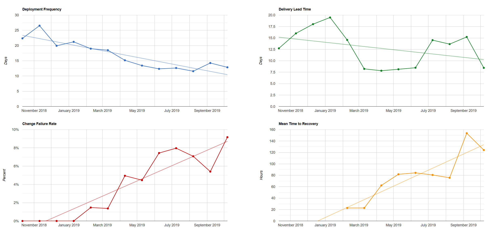

# RedGate.Metrics

Metric generation used at Redgate Software

## Four Key Metrics

The State of DevOps reports have focused on data-driven and statistical analysis of high-performing organizations. The result of this multi-year research, published in the book "Accelerate", demonstrates a direct link between organizational performance and software delivery performance.

The researchers have determined that four key metrics differentiate between low, medium and high performers: delivery lead time, deployment frequency, mean time to restore (MTTR) and change fail percentage.

We aim to use these metrics at Redgate to help us focus on measuring and improving what matters.

If you'd like to know more, see our blog at [ingeniouslysimple.com](https://medium.com/ingeniouslysimple/learning-from-the-accelerate-four-key-metrics-91725675e30a).

## Implementation

We use the historical data stored in our `git` repositories to provide sufficiently-accurate measures for these metrics.

## Requirements

This code should run with any recent version of `Python`. This should include running on non-Windows hosts.

You'll need the `git` commandline tools available, and the repository/s you want to analyse.

## Usage

### Simple Report Generation

There's a helper method available to create a simple report for a single-product repository:

`invoke_four_key_metrics_report_generation`

The `publish_four_key_metrics_report` method is specific to Redgate's infrastructure, but is optional and easily skipped by not providing suitable credentials.

### Complex Report Generation

When reporting on the combination of multiple products, we need to do a little more work:

* Generate the release metrics for each product using `get_release_metrics_for_checkout`
* Combine those release metrics into a single list
* Calculate average metrics for that single list using `get_bucketed_release_metrics_for_report`
* Create an HTML report using `new_four_key_metrics_report`

## How are they calculated?

### Deployment Frequency

Given a list of tagged releases:

* Calculate the time period passed between releases being made
* Present the mean average of those release intervals

### Delivery Lead Time

Given a list of tagged releases:

* Get all new commits included in each release
* Calculate the time between each commit and the time of release (the Delivery Lead Time of each individual commit)
* Keep this list in the object representing the Release
* For a given bucket, take all releases and append their commit lists, and take the median of the time differences calculated above.

NB: This excludes merge commits, but otherwise includes all commits included in the release (including time those commits may have existed on branches, prior to being merged into the release branch).

### Change Fail Percentage

Given a list of tagged releases:

* Present the percentage of releases that were followed by a "fix release" (see *What is a "fix release"?*, below)

### Mean Time to Restore (MTTR)

Given a list of tagged releases:

* Identify the number of failed releases
* For each failed release, calculate how long it was until a "fix release" was issued (the time to restore for each failure)
* Present the mean of those times to restore

## What is a "fix release"?

A fix release is a release whose primary purpose is to correct a serious bug or issue encountered in production. We assume this issue was introduced in the previous release to production.

A fix release may include other changes, but these should always be of a releasable quality.

Typically a fix release will be unplanned, to get the fix to customers as promptly as possible.

## Git Conventions

There are some conventions we need to follow with our use of git to allow accurate generation of metrics.

### Releases must use annotated tags

Git has two different types of tags - annotated and lightweight.

To analyse a repository successfully, releases must use annotated tags.

Existing lightweight tags can be replaced with annotated tags if necessary.

#### Why require annotated tags?

Some of these metrics care about the specific date/time a release is shipped.

Annotated git tags are complete "tag" objects within git and have their own creation date/time timestamp. For our release tags this should be equal to the release date/time (and can be corrected if it is not). This enables accurate reporting on release date.

A lightweight tag is simply a pointer towards another git object (typically a commit) and does not have its own creation timestamp. The best timestamp a lightweight tag can offer is the timestamp of the object it points at. While there is _often_ a commit made during a release process (bumping version numbers, etc.) that we _could_, we _prefer_ to have a consistent tagging approach with intentional release date/time information recorded.

### Releases must be identifiable

We must be able to identify release tags in the repository.

This can be done with any accurate `fnmatch` expression, although a local convention will make this much easier.

For simplicity, the following convention is recommended:

    releases/[version-number]

Where multiple products are released from the same repo, a per-product convention should be adopted:

    releases/[product-ident]/[version-number]

### Fix Releases must be identifiable

To identify change/fail rates and MTTR, we rely on recording when we recover from failure. That means tagging a "fix" release in a way we can identify.

For simplicity, the following convention is recommended:

    [release-tag]/fix

## Developer Information

Tests can be run by executing `Tests/FourKeyMetrics_Tests.py`. This will require `unittest`.

This code wasn't test-driven, so coverage is patchy. All future work should be test-driven, including refactoring and bug-fixing.
